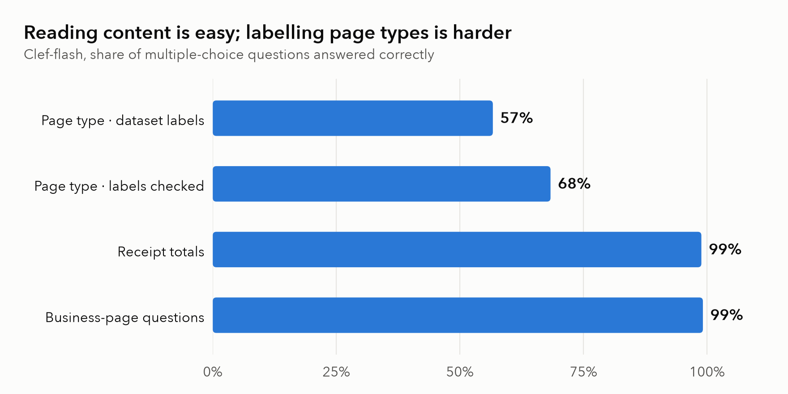
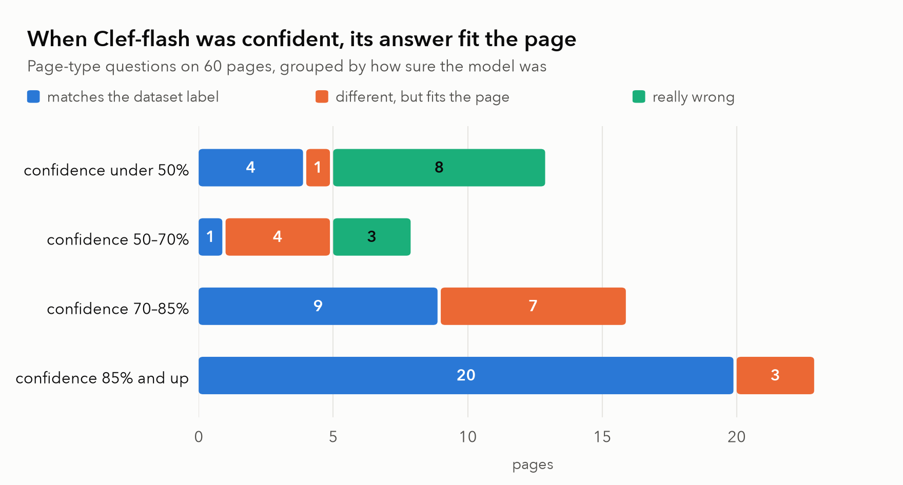
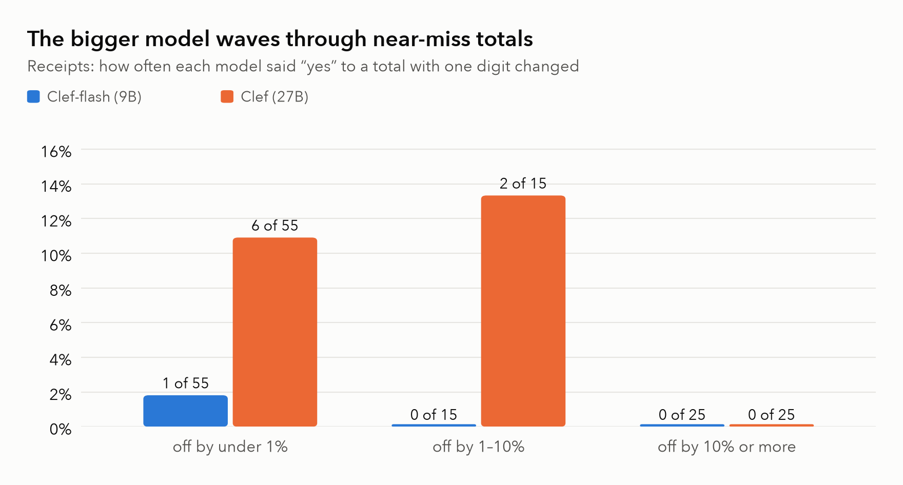

# Can an AI that never writes a word read your documents?

*We tested Cloudflare's new open "decision model" on scanned pages, receipts and
business documents. It reads them remarkably well, and its sense of when it
might be wrong turned out to be the most useful part.*

---

## A different kind of AI model

Most AI models you have used are talkers: you ask a question and they write
an answer. That is great for conversation and awkward for paperwork. If all
you want to know is *"is this an invoice?"* or *"is the total 31,000?"*, a long
written reply is slow, costs money, sometimes comes back in the wrong format,
and gives no honest signal of how sure the model is.

**Decision models** work differently. You hand over a page and a set of
questions with fixed answers ("yes or no", "pick one of these"), and the
model returns a **probability for every allowed answer**. Nothing is written.
You get, say, *invoice 92%, receipt 6%, letter 2%*, and you decide what to do.

On 1 October 2026 Cloudflare released two open models of this kind, **Clef**
(27 billion parameters) and the smaller, faster **Clef-flash** (9 billion).
Unlike the category's original, Jev, they can look at **images**. Cloudflare
published more than forty benchmarks, all of them text-only. None
involved documents, and none showed whether the probabilities can be trusted.

So we tested exactly that. Since this is the everyday work of document
processing, we asked two things: **how often is it right, and does its
confidence mean anything?**

## What we tested

Three sets of real, publicly available documents, every answer taken from
human-made labels:

1. **What kind of page is this?** 60 scanned pages from a classic archive
   (RVL-CDIP: letters, memos, forms, invoices, adverts… 16 types), plus an
   option we added for blank pages.
2. **What is the total on this receipt?** 95 phone photos of shop receipts
   (CORD). The model had to pick the total out of the other amounts printed
   on the same receipt, and to reject totals with **a single digit changed**.
3. **Questions about business pages.** 120 pages of letters, forms, tables,
   charts and handwriting (DocVQA), with questions like *"What is the
   corrected dinner time?"* The wrong answer options were real text taken from
   the same page.

Every question was asked in two ways: as a multiple choice, and as a plain
yes/no ("Is the answer 42.7%?"). We used the hosted version on Cloudflare
with no training or tuning: the model exactly as it ships.

## Finding 1: reading content works

On the two content tasks, Clef-flash was right **about 99% of the time**: 86 of
87 receipt totals picked correctly, and 118 of 119 business-page questions.
It handled tables, forms, handwriting and charts alike, scoring between 97%
and 100% on each kind of page.

The yes/no questions are the stricter test, because the wrong value can be
almost right. Asked *"Is the total 40.001?"* about a receipt that says 40.000,
it said no, with 98% confidence. Over all 95 receipts it fell for a changed
digit only once.

Its confidence also matched reality. When it said it was 95% sure, it was
right about 95% of the time. That is not a given, and it is what you need if
you want to let a machine approve some documents and send the rest to a
person.

## Finding 2: the "bad" score was mostly the labels

The page-type test looked poor at first: **57%** right. But when we looked at
the pages it "got wrong", many of them weren't wrong at all:

- A page labelled *letter* is headed, in large type, **"Interoffice
  Memorandum"**. The model said *memo*, 95% sure.
- A page labelled *resume* contains a single word: **"APPENDIX"**. The model
  said *blank or unreadable*.
- A *handwritten* page is a handwritten **research report**. The model said
  *scientific report*. Both are true.

To check this fairly, a separate reviewer looked at every missed page
**without seeing what the model had said**. Of the 26 misses, 11 had a label
problem: wrong (4), not visible on the page at all (4), or one of two equally
true answers (3).

The striking part is how this lines up with confidence. **Every answer given
with 70% confidence or more either matched the label or fitted the page.**
The answers that were truly wrong all came with low confidence. Re-scored with
the checked labels, accuracy rises to 68%, and to 82% if any answer that fits
the page counts as right.

So even where the headline number looks weak, the model's confidence tells
you which answers to trust. That matters more than the number itself.

## Finding 3: bigger is not always safer

We repeated the receipt and page-type tests with the larger Clef (27B). It
was a little better at choosing: 63% against 57% on page types, and it got
every receipt total right in multiple choice. But on the strictest test it did
worse.

Shown a total with one digit changed, the big model said **"yes, that's the
total"** 8 times out of 95; Clef-flash did so once. The big model's slips were
almost all **near misses**, a total within a few percent of the real one,
and sometimes very confident: it accepted *30.900* for a receipt that clearly
says *30.000* with 95% confidence. Clef-flash behaves like a careful
proof-reader checking digit by digit; the larger model behaves more like
someone who glances and thinks "close enough".

For checking extracted values, the most common job in document processing,
**the smaller, faster and cheaper model was the safer one** here. (The counts
are small, so treat this as a strong hint, not a law.)

## Things we learned the hard way

- **Large images are refused.** The hosted service estimates an image's size
  from its encoded text rather than its pixels, so anything above roughly
  185 KB is rejected, however simple the picture. We resized pages to at most
  1,024 pixels on the long side, and had to skip some dense scans.
- **"Confidence" can mean different things.** The hosted API returns a
  `confidence` field that is *not* the probability of the chosen answer: it
  measures how bunched up all the probabilities are. If you set thresholds,
  use the probabilities themselves.
- **Benchmarks have mistakes too.** Old datasets contain wrong labels, and our
  own test builder once paired "6-2-97" with "June 2, 1997" as if they were
  different answers. Look at the failures before believing the score.
- **It is fast and, at this scale, free.** Answers came back in about half a
  second, and all our runs fit inside Cloudflare's daily free allowance until
  the very last one.

## The fine print

These are small tests: 60 to 120 documents each, run through a hosted
service whose model version we cannot pin. Images were shrunk to fit the size
limit. The label review was done with AI assistance and still needs a final
human pass. The receipts and business pages are public, clean and in
English or Indonesian; your documents may be messier.

## What's next

Reading a single value is clearly within reach. Next we want to test harder
content: line items, counts, whether the numbers on a page add up, and real
invoices. We also want to see whether the "close enough" behaviour of the
larger model holds up on more data.

*All code, prompts, raw model replies and the full research journal are in the
[doc-jev repository](https://github.com/vignesh865/doc-jev). Every number and
chart in this post is generated from those raw replies by
`results/make_blog.py`.*
